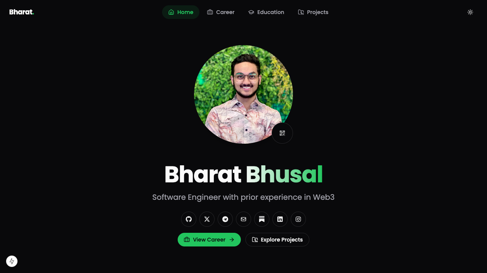

# Portfolio Website

A modern, minimal, and fully dynamic portfolio website built with **Next.js 15**, **TypeScript**, **Tailwind CSS**, and **shadcn/ui**. Features dark/light theme options, GSAP entrance animations, vCard QR contact integration, live GitHub repository querying, and rendering of diagrams inside Markdown files.

## Documentation

For architectural patterns, developer guidelines, and customization walkthroughs, refer to the documentation:

*   [High-Level Design (HLD)](docs/HLD.md) — System boundaries, data caching flow, and Next.js route groups.
*   [Low-Level Design (LLD) ](docs/LLD.md) — State hooks, code interfaces, pagination logic, and hydration fixes.
*   [User Journey](docs/USER_JOURNEY.md) — Step-by-step visitor search sequence diagrams and interface states.
*   [How to Fork & Customize](docs/CUSTOMIZE.md) — Guide on environment setups, profile assets, and static data arrays.
*   [Screenshots Walkthrough](docs/screenshots.md) — Visual tour of every page with captured screenshots.

---

## Features

### Core
- **Dark/Light Theme**: Smooth theme switching via a toggle in the header (persisted with `next-themes`).
- **vCard QR Code**: Interactive profile toggle (Avatar photo $\leftrightarrow$ save-contact QR code) using `qrcode.react`.
- **GSAP Animations**: Micro-animations and entrance reveals for text headings and cards.
- **Responsive Layout**: Mobile-first grid layouts matching sm/md/lg/xl browser breakpoints.

### Projects & GitHub Integration
- **Live Repository Fetching**: Retrieves repositories, stars, forks, primary languages, and last updated dates on the server using a unified fetch client.
- **Toglable Search & Sorting**: Instant client-side text query search with an absolute results count badge. Sorting buttons toggle sort directions (`asc`/`desc`) dynamically.
- **Dropdown Topic Filtering**: Groups all unique topics across repositories in a clean dropdown menu including repository counts next to each tag.
- **Featured / Pinned Repository Priority**: Move key repositories (flagged with `"pin"` topic on GitHub settings) to the top of the listings page automatically, applying a custom highlight border.
- **Dynamic README Rendering**: Dynamic sub-route (`/projects/[repoName]`) that decodes and parses repository `README.md` files safely using GFM specifications.
- **Mermaid Diagrams Integration**: Native compilation of Mermaid graphs inside markdown readme files. Automatically compiles diagram syntax to SVGs inside the client browser.
- **Transition Skeleton Loaders**: Fluid loading skeletons for project lists and README rendering files.

---

## Getting Started

### 1. Fork and Clone
```bash
git clone https://github.com/yourusername/portfolio.git
cd portfolio
npm install
```

### 2. Environment Configurations
Create a `.env` (or `.env.local`) file in the root directory:
```env
GITHUB_USERNAME=yourusername
NEXT_PUBLIC_GITHUB_USERNAME=yourusername
GITHUB_TOKEN=ghp_yourtokenhere
```

### 3. Local Development
```bash
npm run dev
```

### 4. Build for Production
```bash
npm run build
npm start
```

---

## Screenshots

### Main Page


