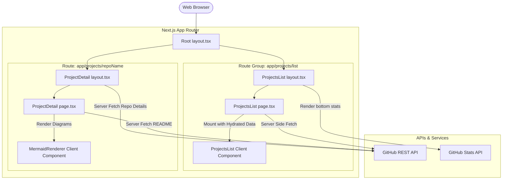

# High-Level Design (HLD)

This document outlines the high-level architecture and system components of the portfolio website.

## Architecture Diagram

The application is built on top of the **Next.js 15 App Router** using React Server Components (RSC) by default for data fetching, combined with dynamic Client Components for user interactivity.



## System Components

### 1. Root Layout (`app/layout.tsx`)
- Defines the main HTML shell (theme providers, styling, fonts).
- Renders the global shared Header and Footer navigation elements.

### 2. Route Groups Separation
To avoid resource leaks and layout overlap, we split the projects routes:
- **Listing View Group (`app/projects/(list)`)**:
  - The shared listing layout renders the header and embeds the **GitHub Statistics** widget at the bottom of the page.
  - The page fetches all repositories on the server and passes them to the interactive `ProjectsList` client component.
- **Detail View Group (`app/projects/[repoName]`)**:
  - Encapsulates its own dedicated layout to fetch repository names and descriptions on the server.
  - Excludes the `GitHubStats` widget completely, preventing stats leakage.

### 3. Server-Side Data Fetching & Caching
- All API requests to GitHub (`/users/repos`, `/repos/details`, and `/repos/readme`) are executed on the server side using a unified fetch client.
- To prevent GitHub rate limit exhaustion, Next.js page data collection is configured to cache API responses using Next.js caching headers:
  ```typescript
  next: { revalidate: 3600 } // Cache API responses for 1 hour
  ```

### 4. Interactive Client Boundaries
Client-side interactivity is deferred to leaf components:
- **`ProjectsList`**: Manages search state, sorting field/order, topic dropdown selectors, and page indices.
- **`MermaidRenderer`**: Handles client-side SVG generation for Mermaid graphs, ensuring no web API execution occurs during server-rendering (SSR).
- **`ToggleProfileQR`**: Interactive button to switch between the profile avatar and a vCard QR code.
