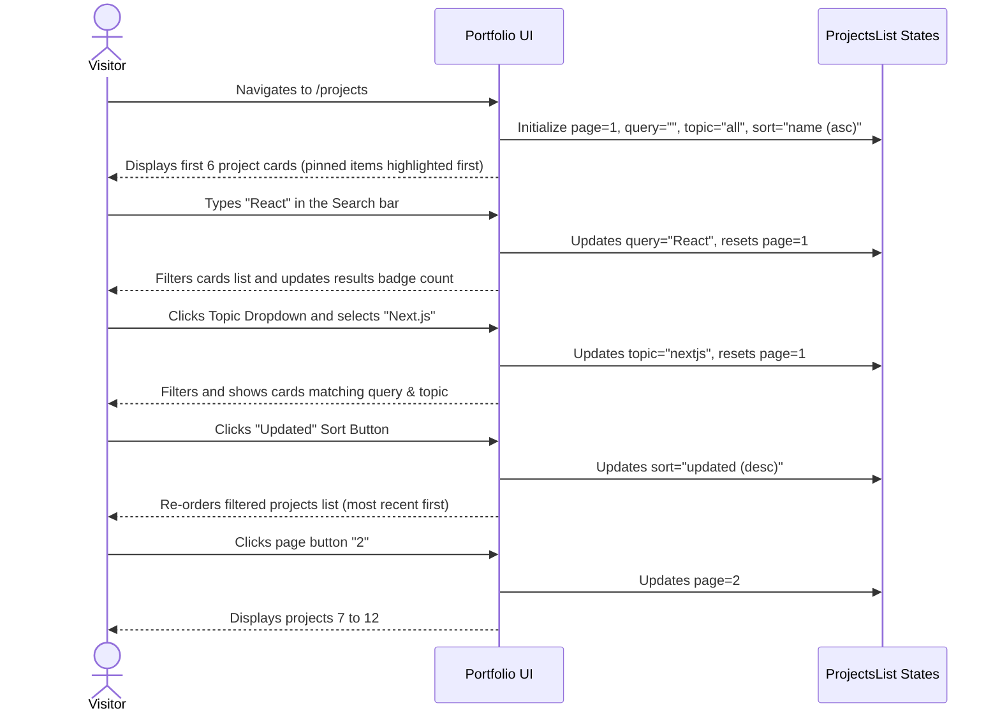
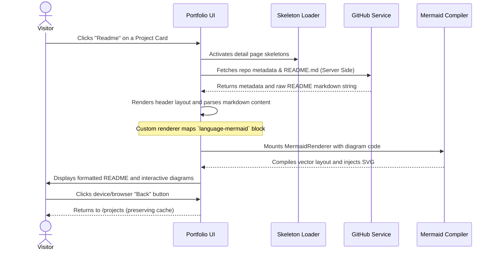

# User Journey

This document describes the interactive user flows and navigational pathways for visitors browsing the portfolio website.

## Navigational Paths & States

### Scenario 1: Browsing and Filtering the Projects Page

---

### Scenario 2: Reading Repository Details & Diagrams

## Highlights of the User Experience

1. **Fluid Loading Skeletons**: Visitors encounter clean layout frames instead of blank white screens during dynamic data fetching, keeping page load perceived performance high.
2. **Instant Search Feedback**: Results count badges and listing grids update instantly as the user types keywords, avoiding full page refreshes.
3. **Optimized Pagination Layout**: Restricting page indexes using middle page ellipses ensures the navigation bar looks clean and readable on mobile views.
4. **Isolated README Layouts**: Accessing project sub-routes exposes full-width markdown views without trailing statistics sections, ensuring readers can focus strictly on the project details.
